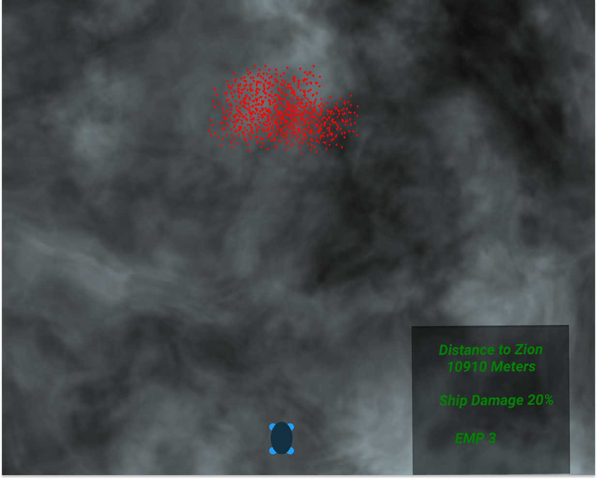
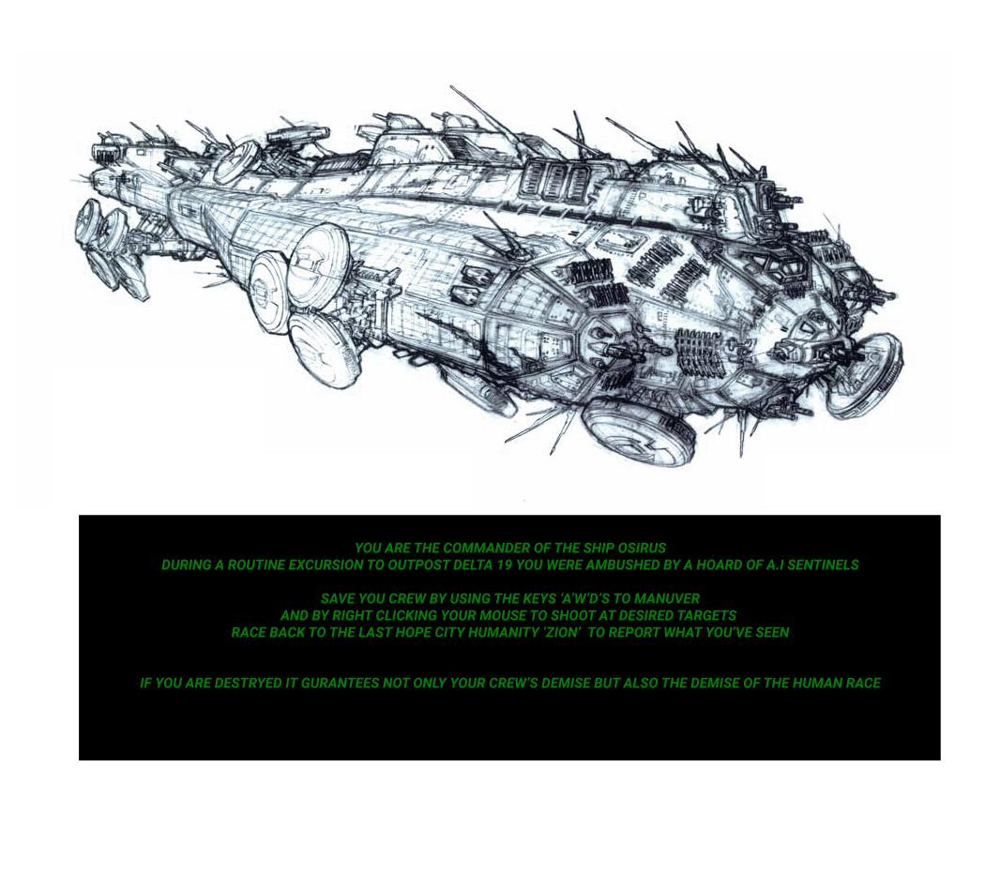
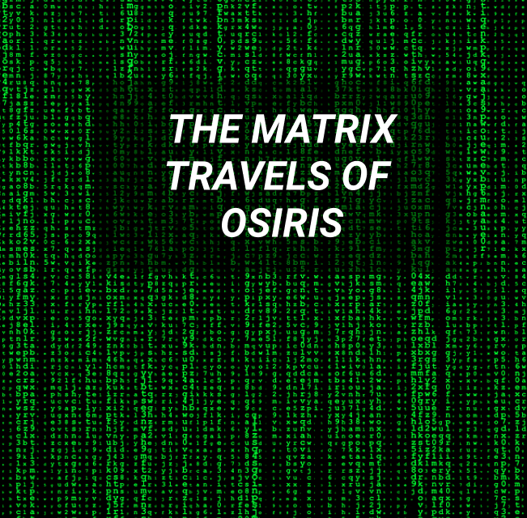

TRAVLES OF OSIRIUS 
MY FIRST REAL GAME

TASK LIST
.[✓]Create A Folder
    .[✓]JavaScript
    .[✓]CSS
    .[✓]HTML
    .[✓]CREATE ASSETS FOLDER
.[✓]Create a screen that takes up entire window
.[✓]Make ship show up on sceen
.[]Make ship move 
    .[✓]forwrads
    .[✓]left
    .[✓]right
    .[✓]back
    .[✓]Align movement to 'a''w''d''s' key press
.[]Make an enemy
    .[✓]make 3 enemys 
    .[✓]break down functions into small more maluable pieces
    .[✓]create an orbit of A.I around Host
    .[✓]make the enemies attract to eachother like a hoard
    .[✓]ensure enemies dont overlap
    .[✓]make the enemies attarct to ship
    .[✓]make enemy object scaleable 
.[]give ship projectiles
    .[]on click create projectiles
    .[]give direction to projectiles
    .[]make projectiles destory enemies on contact 
    .[]make projectiles destory self on contact with enemies or screen boundreis
.[✓ ]create HUD
    .[]create time frame to end game
    .[]make time frame mesured by meters counting down
    .[]make spawning of enemies increase by distance decreasing 
.[]create a score 
    .[]disply on HUD
////////////////////////////////////////////// MVP ///////////////////////////////////////////////////////////
.[] Create aiming with mouse
    .[]capture mouse position
    .[] set direction x & y of projectile
    .[] send projectile in direction 
    .[]if hits multiple eneimes at once delete all parties

